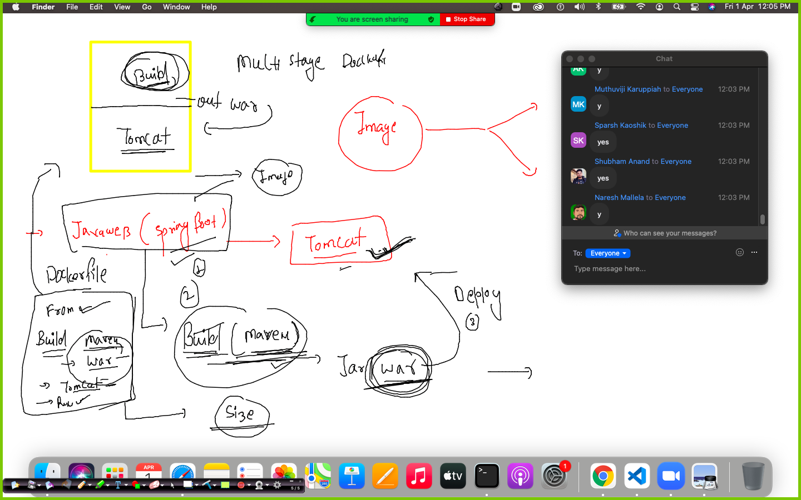
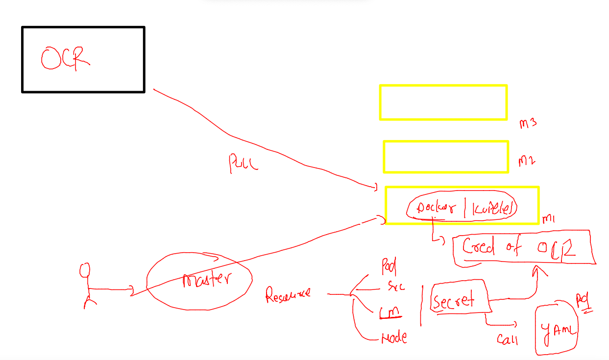
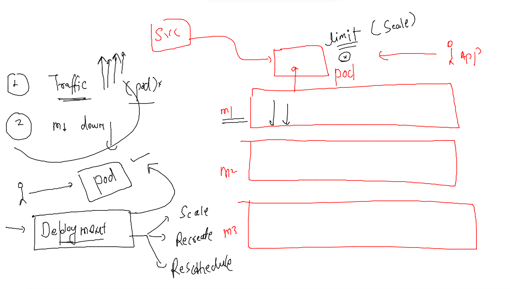
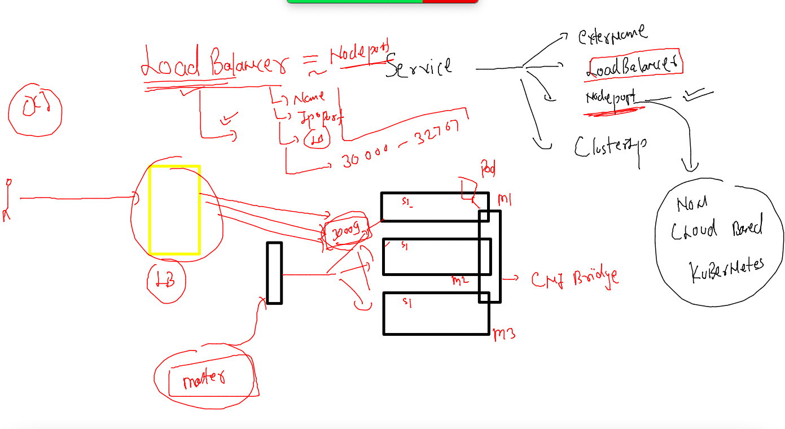

# Plan 


## k8s revision 1 


### etcd -- brain of k8s 


### service understanding again 


### deleting 

```
kubectl delete pod,svc --all
pod "amitwebapp" deleted
pod "ashuwebapp" deleted
pod "chethanwebapp" deleted
pod "ganeshwebapp" deleted
pod "muthuwebapp" deleted
pod "sameerwebapp" deleted
pod "shubhamwebapp" deleted
pod "skpod1" deleted
pod "skwebapp" deleted
service "ashulb1" deleted
service "chethanlb1" deleted
service "ganeshlb1" deleted
```

### creating pod 

```
 565  kubectl  run  ashuwebpod  --image=dockerashu/customerapp:30thmarch2022     --port 80 
  566  history r
  567  history 
[ashu@docker-new-vm myimages]$ kubectl get  po
NAME            READY   STATUS    RESTARTS   AGE
ashuwebpod      1/1     Running   0          27s
shubhamwebpod   1/1     Running   0          8s
[ashu@docker-new-vm myimages]$ kubectl get  po
NAME            READY   STATUS    RESTARTS   AGE
ashuwebpod      1/1     Running   0          40s
shubhamwebpod   1/1     Running   0          21s
[ashu@docker-new-vm myimages]$ kubectl get  po
NAME            READY   STATUS    RESTARTS   AGE
ashuwebpod      1/1     Running   0          83s
ganeshwebpod    1/1     Running   0          25s
muthuwebpod     1/1     Running   0          40s
nareshwebpod    1/1     Running   0          21s
sameerwebpod    1/1     Running   0          14s
shubhamwebpod   1/1     Running   0          64s
skpod           1/1     Running   0          15s
[ashu@docker-new-vm myimages]$ kubectl get  po -o wide
NAME            READY   STATUS    RESTARTS   AGE   IP                NODE                            NOMINATED NODE   READINESS GATES
ashuwebpod      1/1     Running   0          98s   192.168.203.219   ip-172-31-85-52.ec2.internal    <none>           <none>
ganeshwebpod    1/1     Running   0          40s   192.168.203.254   ip-172-31-85-52.ec2.internal    <none>           <none>
muthuwebpod     1/1     Running   0          55s   192.168.93.9      ip-172-31-29-225.ec2.internal   <none>           <none>
nareshwebpod    1/1     Running   0          36s   192.168.203.216   ip-172-31-85-52.ec2.internal    <none>           <none>
sameerwebpod    1/1     Running   0          29s   192.168.93.40     ip-172-31-29-225.ec2.internal   <none>           <none>
shubhamwebpod   1/1     Running   0          79s   192.168.93.21     ip-172-31-29-225.ec2.internal   <none>           <none>
skpod           1/1     Running   0          30s   192.168.203.252   ip-172-31-85-52.ec2.internal    <none>           <none>
[ashu@docker-new-vm myimages]$ 
```

### before you create service check pod labels 

```
kubectl get  po --show-labels
NAME             READY   STATUS             RESTARTS      AGE     LABELS
amittest1        0/1     CrashLoopBackOff   3 (32s ago)   7m56s   run=amittest1
amittest2        1/1     Running            3 (34s ago)   5m48s   run=amittest2
amitwebpod       1/1     Running            0             10m     run=amitwebpod
ashutest1        1/1     Running            3 (87s ago)   6m42s   run=ashutest1
ashuwebpod       1/1     Running            0             13m     run=ashuwebpod
chethanwebpod    1/1     Running            0             10m     run=chethanwebpod

```

### service of nodeport type 

### yaml generate 

```
[ashu@docker-new-vm myimages]$ kubectl  create  service  
Create a service using a specified subcommand.

Aliases:
service, svc

Available Commands:
  clusterip    Create a ClusterIP service
  externalname Create an ExternalName service
  loadbalancer Create a LoadBalancer service
  nodeport     Create a NodePort service

Usage:
  kubectl create service [flags] [options]

Use "kubectl <command> --help" for more information about a given command.
Use "kubectl options" for a list of global command-line options (applies to all commands).
[ashu@docker-new-vm myimages]$ kubectl  create  service  nodeport  ashusvc1  --tcp  1234:80   --dry-run=client -oyaml 
apiVersion: v1
kind: Service
metadata:
  creationTimestamp: null
  labels:
```

### matching service selector 


### service check 

```

[ashu@docker-new-vm k8s_apps]$  kubectl get  po  ashuwebpod  --show-labels
NAME         READY   STATUS    RESTARTS   AGE   LABELS
ashuwebpod   1/1     Running   0          17m   run=ashuwebpod
[ashu@docker-new-vm k8s_apps]$ kubectl apply -f ashusvc.yaml 
service/ashusvc1 created
[ashu@docker-new-vm k8s_apps]$ kubectl   get  svc
NAME         TYPE        CLUSTER-IP       EXTERNAL-IP   PORT(S)          AGE
ashusvc1     NodePort    10.103.94.2      <none>        1234:31712/TCP   4s
ganeshvc1    NodePort    10.106.219.118   <none>        1234:30841/TCP   4s
```

### matching pod label with service selector 

```
  kubectl get  po  ashuwebpod  --show-labels
NAME         READY   STATUS    RESTARTS   AGE   LABELS
ashuwebpod   1/1     Running   0          28m   run=ashuwebpod
[ashu@docker-new-vm k8s_apps]$ 
[ashu@docker-new-vm k8s_apps]$ 
[ashu@docker-new-vm k8s_apps]$ kubectl  get  svc  ashusvc1  -o wide
NAME       TYPE       CLUSTER-IP    EXTERNAL-IP   PORT(S)          AGE     SELECTOR
ashusvc1   NodePort   10.103.94.2   <none>        1234:31712/TCP   8m27s   run=ashuwebpod
[ashu@docker-new-vm k8s_apps]$ 

```

### generate yaml from running pod 

```

 kubectl   get  po  ashuwebpod  -o yaml   >frompod.yaml 
 
```

### making required changes and replace it 

```
kubectl replace -f  frompod.yaml  --force
pod "ashuwebpod" deleted
pod/ashuwebpod replaced
```

### Intro to CONfigMAP 


### creating confimap 

```
 kubectl   create configmap  varstore  --from-literal  deploy=webapp3 
configmap/varstore created
[ashu@docker-new-vm k8s_apps]$ kubectl  get  configmap 
NAME               DATA   AGE
kube-root-ca.crt   1      29d
varstore           1      10s

```

### calling configmap in pod yaml 


### namespaces in k8s

```
 kubectl  get  po 
No resources found in default namespace.
[ashu@docker-new-vm k8s_apps]$ 
[ashu@docker-new-vm k8s_apps]$ 
[ashu@docker-new-vm k8s_apps]$ kubectl  get  namespaces 
NAME              STATUS   AGE
ajeet-ns          Active   3d16h
ashu-project      Active   3d16h
default           Active   29d
kube-node-lease   Active   3d16h
kube-public       Active   29d
kube-system       Active   29d
manoj-ns          Active   3d16h
surbhi-ns         Active   3d16h
[ashu@docker-new-vm k8s_apps]$ kubectl  create  namespace  ashu-space 
namespace/ashu-space created
[ashu@docker-new-vm k8s_apps]$ kubectl  get  namespaces 
NAME              STATUS   AGE
ajeet-ns          Active   3d16h
ashu-project      Active   3d16h
ashu-space        Active   4s

```

### setting default namespace 

```
kubectl  get  po 
No resources found in default namespace.
[ashu@docker-new-vm k8s_apps]$ 
[ashu@docker-new-vm k8s_apps]$ kubectl  config  set-context  --current  --namespace  ashu-space 
Context "kubernetes-admin@kubernetes" modified.
[ashu@docker-new-vm k8s_apps]$ 
[ashu@docker-new-vm k8s_apps]$ kubectl  get  po 
No resources found in ashu-space namespace.
```

### 

```
kubectl  config get-contexts 
CURRENT   NAME                          CLUSTER      AUTHINFO           NAMESPACE
*         kubernetes-admin@kubernetes   kubernetes   kubernetes-admin   ashu-space
[ashu@docker-new-vm k8s_apps]$ 
```
### deploy pod 

```
 kubectl apply -f  webapp.yaml 
pod/ashuwebapp configured
[ashu@docker-new-vm k8s_apps]$ 
[ashu@docker-new-vm k8s_apps]$ kubectl   get  po 
NAME         READY   STATUS    RESTARTS   AGE
ashuwebapp   1/1     Running   0          35s
[ashu@docker-new-vm k8s_apps]$ 

```

### creating service from a running pod 

```
kubectl  get  pod 
NAME         READY   STATUS    RESTARTS   AGE
ashuwebapp   1/1     Running   0          118s
[ashu@docker-new-vm k8s_apps]$ kubectl  expose pod ashuwebapp  --type NodePort  --port 1234 --target-port  80  --name  ashusvc1 
service/ashusvc1 exposed
[ashu@docker-new-vm k8s_apps]$ kubectl  get  svc
NAME       TYPE       CLUSTER-IP       EXTERNAL-IP   PORT(S)          AGE
ashusvc1   NodePort   10.101.112.235   <none>        1234:32264/TCP   36s

```

## Multi stage dockerfile 



### deploy ocr image to k8s 

```
kubectl   run  ashujavaapp --image=phx.ocir.io/axmbtg8judkl/tomcatapp:v1    --port  8080  --dry-run=client -oyaml  >privateapp.yaml 

```

### introduction to secret in k8s 



### creating secret to store OCR credential 

```
kubectl create  secret  
Create a secret using specified subcommand.

Available Commands:
  docker-registry Create a secret for use with a Docker registry
  generic         Create a secret from a local file, directory, or literal value
  tls             Create a TLS secret

Usage:
  kubectl create secret [flags] [options]

Use "kubectl <command> --help" for more information about a given command.
Use "kubectl options" for a list of global command-line options (applies to all commands).
[ashu@docker-new-vm k8s_apps]$ kubectl create  secret  docker-registry  ashuappsec  --docker-server phx.ocir.io --docker-username  axmbtg8judkl/learntechbyme@gmail.com  --docker-password="5QH}bG04nWJ-dvS72v6O"
secret/ashuappsec created
```

### use secret and run it 

```
kubectl replace -f  privateapp.yaml  --force 
pod "ashujavaapp" deleted
pod/ashujavaapp replaced
[ashu@docker-new-vm k8s_apps]$ kubectl get   po 
NAME          READY   STATUS              RESTARTS   AGE
ashujavaapp   0/1     ContainerCreating   0          12s

```

### task history 

```
kubectl create  namespace  ashuk8s1  --dry-run=client -oyaml >mytask.yaml 
  724  kubectl  run ashupod1 --image=ubuntu --command sleep 1000 --namespace  ashuk8s1 --dry-run=client -oyaml  >>mytask.yaml 
  725  kubectl create  service nodeport  ashusvc123 --tcp 1234:80 --namespace  ashuk8s1 --dry-run=client -oyaml >>mytask.yaml 
  726  kubectl apply -f mytask.yaml 
  727  kubectl  get pod,svc -n ashuk8s1 
  728  kubectl delete -f  mytask.yaml 
  
```

### Intro to deployment 



## creating deployment 

```
kubectl create deployment ashudep  --image=dockerashu/customerapp:30thmarch2022   --port 80 --dry-run=client  -o yaml  >deployment.yaml 
```

### deploy 

```
 440  kubectl create deployment d1 --image=dockerashu/customerapp:30thmarch2022 --port 80 
  441  kubectl get deploy 
  442  kubectl get  po 
  443  kubectl get deploy 
  444  history 
  445  kubectl get deploy 
  446  kubectl get po 
  447  kubectl delete pod d1-74858f96cd-z7qsz
  448  kubectl get po 
  449  kubectl get deploy 
  450  kubectl scale deploy d1 --replicas=3
  451  kubectl get po 
  
 ```
 
 ### loadbalancer service 
 
 
 
 ### creating lb service 
 
 ```
 kubectl get deploy 
NAME   READY   UP-TO-DATE   AVAILABLE   AGE
d1     3/3     3            3           15m
learntechb@cloudshell:~ (us-phoenix-1)$ kubectl get po 
NAME                  READY   STATUS    RESTARTS   AGE
d1-74858f96cd-4xsmh   1/1     Running   0          14m
d1-74858f96cd-fvs4m   1/1     Running   0          12m
d1-74858f96cd-mf4f2   1/1     Running   0          12m

----

type: Unsupported value: "LoadBalacer": supported values: "ClusterIP", "ExternalName", "LoadBalancer", "NodePort"
learntechb@cloudshell:~ (us-phoenix-1)$ kubectl expose deploy  d1 --type LoadBalancer  --port 80 --name ashusvc1
service/ashusvc1 exposed
learntechb@cloudshell:~ (us-phoenix-1)$ kubectl get svc
NAME         TYPE           CLUSTER-IP      EXTERNAL-IP   PORT(S)        AGE
ashusvc1     LoadBalancer   10.96.190.176   <pending>     80:32281/TCP   12s

```

### Dashboard in k8s 

```
https://kubernetes.io/docs/tasks/access-application-cluster/web-ui-dashboard/

```

### deploy dashboard 

```
kubectl apply -f https://raw.githubusercontent.com/kubernetes/dashboard/v2.5.0/aio/deploy/recommended.yaml
namespace/kubernetes-dashboard created
serviceaccount/kubernetes-dashboard created
service/kubernetes-dashboard created
secret/kubernetes-dashboard-certs created
secret/kubernetes-dashboard-csrf created
secret/kubernetes-dashboard-key-holder created
configmap/kubernetes-dashboard-settings created
role.rbac.authorization.k8s.io/kubernetes-dashboard created
clusterrole.rbac.authorization.k8s.io/kubernetes-dashboard created
rolebinding.rbac.authorization.k8s.io/kubernetes-dashboard created
clusterrolebinding.rbac.authorization.k8s.io/kubernetes-dashboard created
deployment.apps/kubernetes-dashboard created
service/dashboard-metrics-scraper created
deployment.apps/dashboard-metrics-scraper created
learntechb@cloudshell:~ (us-phoenix-1)$ kubectl get ns
NAME                   STATUS   AGE
default                Active   59m
kube-node-lease        Active   59m
kube-public            Active   59m
kube-system            Active   59m
kubernetes-dashboard   Active   19s
```

### changing svc type 

```
 kubectl  -n kubernetes-dashboard  get deploy 
NAME                        READY   UP-TO-DATE   AVAILABLE   AGE
dashboard-metrics-scraper   1/1     1            1           71s
kubernetes-dashboard        1/1     1            1           71s
learntechb@cloudshell:~ (us-phoenix-1)$ kubectl  -n kubernetes-dashboard  get po
NAME                                        READY   STATUS    RESTARTS   AGE
dashboard-metrics-scraper-c45b7869d-5gh5s   1/1     Running   0          81s
kubernetes-dashboard-764b4dd7-pfm29         1/1     Running   0          81s
learntechb@cloudshell:~ (us-phoenix-1)$ kubectl  -n kubernetes-dashboard  get svc
NAME                        TYPE        CLUSTER-IP      EXTERNAL-IP   PORT(S)    AGE
dashboard-metrics-scraper   ClusterIP   10.96.255.141   <none>        8000/TCP   86s
kubernetes-dashboard        ClusterIP   10.96.233.253   <none>        443/TCP    87s
learntechb@cloudshell:~ (us-phoenix-1)$ kubectl  -n kubernetes-dashboard  edit svc kubernetes-dashboard
service/kubernetes-dashboard edited
learntechb@cloudshell:~ (us-phoenix-1)$ kubectl  -n kubernetes-dashboard  get svc
NAME                        TYPE           CLUSTER-IP      EXTERNAL-IP   PORT(S)         AGE
dashboard-metrics-scraper   ClusterIP      10.96.255.141   <none>        8000/TCP        2m10s
kubernetes-dashboard        LoadBalancer   10.96.233.253   <pending>     443:31246/TCP   2m11s
learntechb@cloudshell:~ (us-phoenix-1)$ 
```

### dashboard 

```
 kubectl  -n kubernetes-dashboard  get secret
NAME                               TYPE                                  DATA   AGE
default-token-pxk86                kubernetes.io/service-account-token   3      6m20s
kubernetes-dashboard-certs         Opaque                                0      6m19s
kubernetes-dashboard-csrf          Opaque                                1      6m19s
kubernetes-dashboard-key-holder    Opaque                                2      6m19s
kubernetes-dashboard-token-bqg4s   kubernetes.io/service-account-token   3      6m20s
learntechb@cloudshell:~ (us-phoenix-1)$ kubectl  -n kubernetes-dashboard  describe  secret kubernetes-dashboard-token-bqg4s
Name:         kubernetes-dashboard-token-bqg4s
Namespace:    kubernetes-dashboard
Labels:       <none>
Annotations:  kubernetes.io/service-account.name: kubernetes-dashboard
              kubernetes.io/service-account.uid: 881f595e-1ba6-4308-af1a-a70166c3d9d3

Type:  kubernetes.io/service-account-token

Data
====
ca.crt:     1285 bytes
namespace:  20 bytes
token:      eyJhbGciOiJSUzI1NiIsImtpZCI6Inh2RGxndmtRRk5VVjdr
```

### giving permission to dashboard 

```
 kubectl create clusterrolebinding bind111 --clusterrole=cluster-admin --serviceaccount=kubernetes-dashboard:kubernetes-dashboard
clusterrolebinding.rbac.authorization.k8s.io/bind111 created
```

### webapp with DB 

### Db 

```
 kubectl create deploy db1  --image=mysql:5.6 --port 3306 --dry-run=client -o yaml >db.yaml
 
```

### cluster IP type service 

```
kubectl get deploy 
NAME         READY   UP-TO-DATE   AVAILABLE   AGE
amitdeploy   1/1     1            1           12m
d1           3/3     3            3           76m
db1          1/1     1            1           3m28s
ganeshdep    0/1     1            0           13m
sameeerdep   1/1     1            1           11m
learntechb@cloudshell:~ (us-phoenix-1)$ kubectl expose deploy db1 --type ClusterIP --port 3306 
service/db1 exposed
learntechb@cloudshell:~ (us-phoenix-1)$ kubectl get svc 
NAME         TYPE        CLUSTER-IP      EXTERNAL-IP   PORT(S)    AGE
db1          ClusterIP   10.96.175.135   <none>        3306/TCP   5s
kubernetes   ClusterIP   10.96.0.1       <none>        443/TCP    87m
```

### creating lb type service 

```
 kubectl expose deploy webapp111 --type LoadBalancer --port 80 --name websvc1 
service/websvc1 exposed
learntechb@cloudshell:~ (us-phoenix-1)$ kubectl get svc
NAME         TYPE           CLUSTER-IP      EXTERNAL-IP   PORT(S)        AGE
db1          ClusterIP      10.96.175.135   <none>        3306/TCP       7m23s
kubernetes   ClusterIP      10.96.0.1       <none>        443/TCP        94m
websvc1      LoadBalancer   10.96.88.5      <pending>     80:31345/TCP   5s
learntechb@cloudshell:~ (us-phoenix-1)$ 
```
