# Plan 


## docker revision 

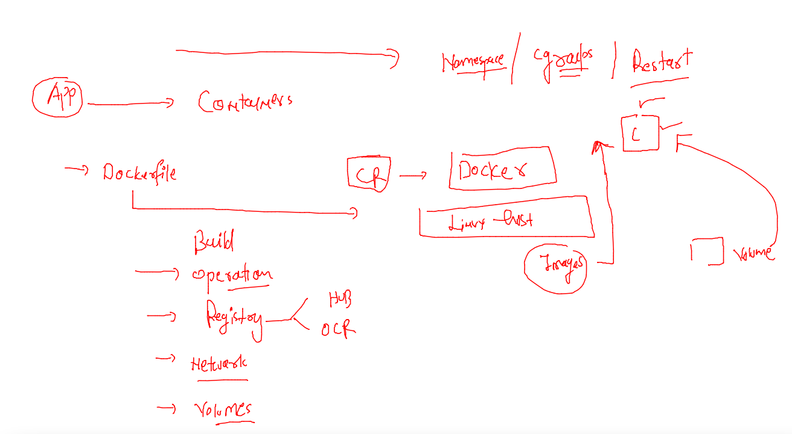

  
## Docker scripting using Compose by Docker 

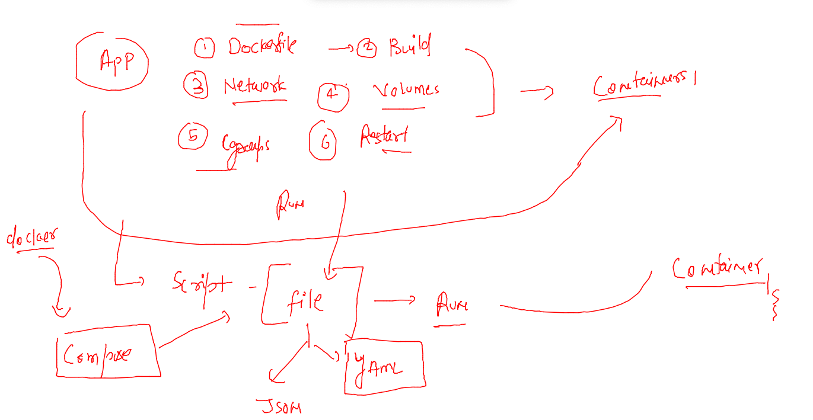

### Installing docker compose for clients and checking version 

[Docker compose](https://docs.docker.com/compose/install/)

### checking 

```
docker-compose  version 
docker-compose version 1.29.2, build 5becea4c
docker-py version: 5.0.0
CPython version: 3.7.10
OpenSSL version: OpenSSL 1.1.0l  10 Sep 2019
```
 
 ### compose file example 1 
 
 ```
 version: '3.8'
services: # about container apps 
 ashuapp1: 
  image: alpine
  container_name: ashuc1
  command: ping fb.com
  restart: always 
 ```
 
 ### run compose 
 
 ```
 cd  ashucomposefiles/
[ashu@docker-new-vm ashucomposefiles]$ ls 
docker-compose.yaml
[ashu@docker-new-vm ashucomposefiles]$ docker-compose up -d
Creating network "ashucomposefiles_default" with the default driver
Creating ashuc1 ... done
[ashu@docker-new-vm ashucomposefiles]$ docker-compose  ps
 Name      Command     State   Ports
------------------------------------
ashuc1   ping fb.com   Up           
 ```
 
### more compose commands

```
]$ docker-compose ps 
 Name      Command     State   Ports
------------------------------------
ashuc1   ping fb.com   Up           
[ashu@docker-new-vm ashucomposefiles]$ ls
docker-compose.yaml
[ashu@docker-new-vm ashucomposefiles]$ docker-compose  stop 
Stopping ashuc1 ... done
[ashu@docker-new-vm ashucomposefiles]$ 
[ashu@docker-new-vm ashucomposefiles]$ 
[ashu@docker-new-vm ashucomposefiles]$ docker-compose ps 
 Name      Command      State     Ports
---------------------------------------
ashuc1   ping fb.com   Exit 137        
[ashu@docker-new-vm ashucomposefiles]$ 
```

### clean up 

```
 docker-compose  down 
Stopping ashuc1 ... done
Removing ashuc1 ... done
Removing network ashucomposefiles_default
```

### Compose file 2 

```
version: '3.8'
services: # about container apps 
 ashuapp2:
  image: dockerashu/customerapp:30thmarch2022
  container_name: ashuc2
  environment: # giving env data 
   app: webapp3  
  ports: # port forwarding like in docker run -p 1234:80 
  - "1234:80"
  restart: always 
 ashuapp1: 
  image: alpine
  container_name: ashuc1
  command: ping fb.com
  restart: always 
```

### run 

```
 ls
ashu.yaml  docker-compose.yaml
[ashu@docker-new-vm ashucomposefiles]$ docker-compose -f ashu.yaml  up -d
Creating network "ashucomposefiles_default" with the default driver
Creating ashuc2 ... done
Creating ashuc1 ... done
[ashu@docker-new-vm ashucomposefiles]$ docker-compose -f ashu.yaml  ps
 Name      Command     State          Ports        
---------------------------------------------------
ashuc1   ping fb.com   Up                          
ashuc2   ./deploy.sh   Up      0.0.0.0:1234->80/tcp
```

### more 

```
docker-compose  -f ashu.yaml  up -d
ashuc2 is up-to-date
ashuc1 is up-to-date
[ashu@docker-new-vm ashucomposefiles]$ docker-compose  -f ashu.yaml   ps
 Name      Command     State          Ports        
---------------------------------------------------
ashuc1   ping fb.com   Up                          
ashuc2   ./deploy.sh   Up      0.0.0.0:1234->80/tcp
[ashu@docker-new-vm ashucomposefiles]$ docker-compose  -f ashu.yaml   kill
Killing ashuc1 ... done
Killing ashuc2 ... done
[ashu@docker-new-vm ashucomposefiles]$ docker-compose  -f ashu.yaml   start
Starting ashuapp2 ... done
Starting ashuapp1 ... done
[ashu@docker-new-vm ashucomposefiles]$ docker-compose  -f ashu.yaml   ps
 Name      Command     State          Ports        
---------------------------------------------------
ashuc1   ping fb.com   Up                          
ashuc2   ./deploy.sh   Up      0.0.0.0:1234->80/tcp
[ashu@docker-new-vm ashucomposefiles]$ docker-compose  -f ashu.yaml   down 
Stopping ashuc1 ... done
Stopping ashuc2 ... done
Removing ashuc1 ... done
Removing ashuc2 ... done
Removing network ashucomposefiles_default
```

### compose file 

```
version: '3.8'
services:
 ashuwebapp:
  image: ashuweb:v007 # image i want to build 
  build: . # location of dockerfile 
  container_name: ashuwebc1
  restart: always
  environment:
   app: webapp2 
  ports:
  - 7744:80 
```

## webUI 

```
docker  run -itd --name webui -p 9000:9000 -v /var/run/docker.sock:/var/run/docker.sock    --restart  always portainer/portainer
```

## Problems with Container runtime 

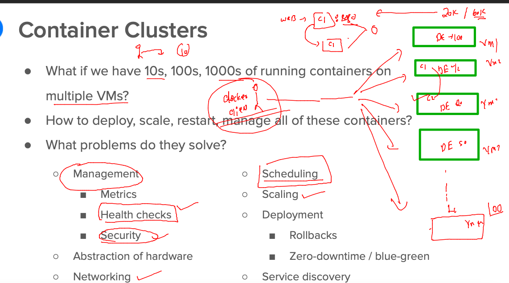

## Intro to k8s 

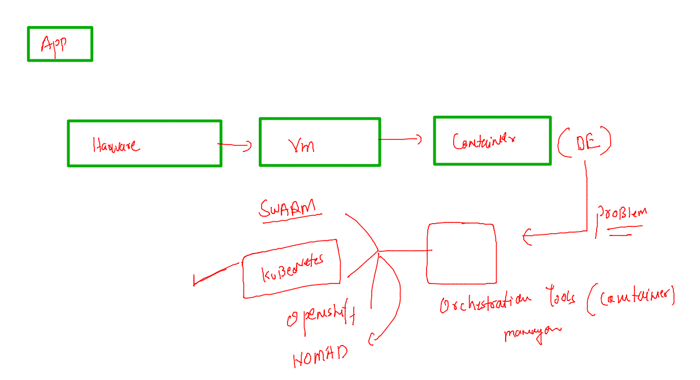

### info k8s 

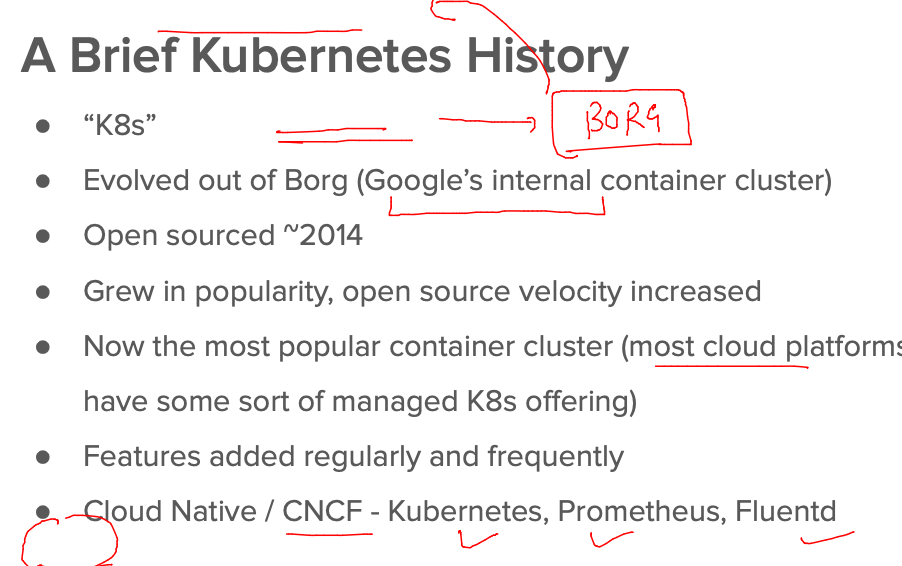

### app deployment showcase 

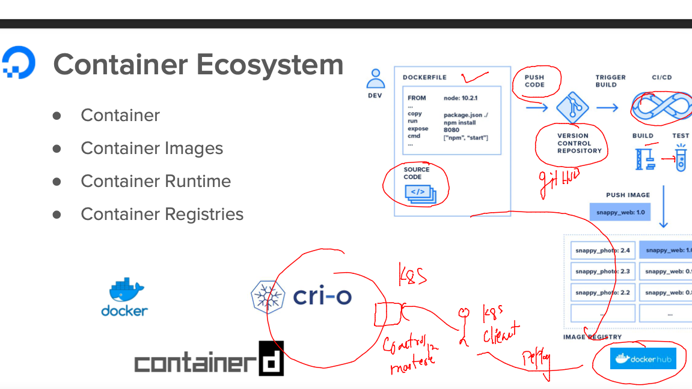

### k8s arch level 1 

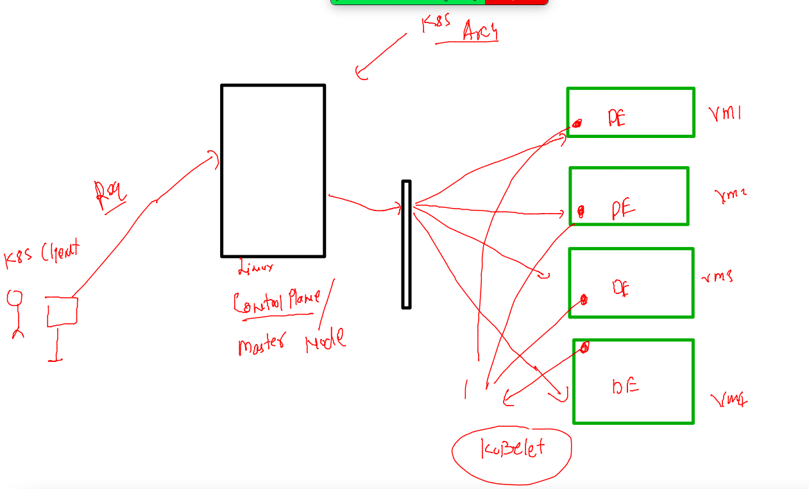

### system 

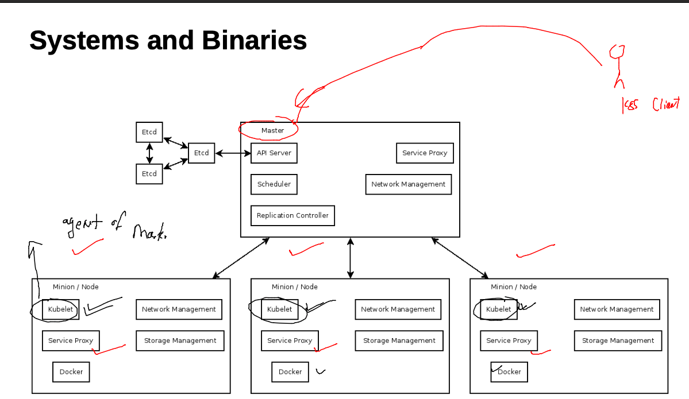

### kube-apiserver 


## Kubectl Install --

[ks_client_install](https://kubernetes.io/docs/tasks/tools/)

### sharing cred file with k8s clients 

### file location on master Node 

```
 cd  /etc/kubernetes/
[root@ip-172-31-90-99 kubernetes]# ls
admin.conf 
```

## Download admin.conf file on the machine you want to configure as k8s client 

### use it like this 

```
 kubectl  get nodes  --kubeconfig  admin.conf 
NAME                            STATUS   ROLES                  AGE    VERSION
ip-172-31-29-225.ec2.internal   Ready    <none>                 7d4h   v1.23.5
ip-172-31-85-52.ec2.internal    Ready    <none>                 28d    v1.23.4
ip-172-31-90-99.ec2.internal    Ready    control-plane,master   28d    v1.23.4
```

### copy admin.conf  to default location  in LInux CLient  and mac client 

```
 cp admin.conf   ~/.kube/config  
```

### check client side connection 

```
 kubectl  cluster-info 
Kubernetes control plane is running at https://3.233.160.167:6443
CoreDNS is running at https://3.233.160.167:6443/api/v1/namespaces/kube-system/services/kube-dns:dns/proxy

To further debug and diagnose cluster problems, use 'kubectl cluster-info dump'.
```


### Pod concpet 

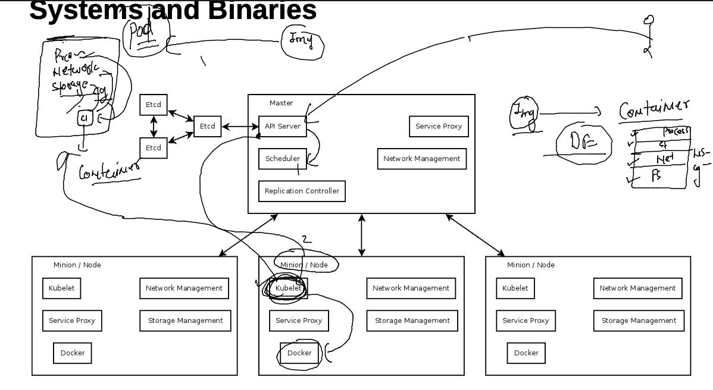

### pod example `

```
apiVersion: v1 
kind: Pod 
metadata: # info about kind type 
 name: ashupod1 # name of pod 
spec:  # details about application 
 containers:
 - name: ashuc1 # u can use it 
   image: alpine 
   command: ["sh","-c","ping fb.com"]

```

### Deploy pod 

```

[ashu@docker-new-vm k8s_apps]$ kubectl apply -f ashupod1.yaml 
pod/ashupod1 unchanged
[ashu@docker-new-vm k8s_apps]$ kubectl get po 
NAME          READY   STATUS    RESTARTS   AGE
amitpod1      1/1     Running   0          2m9s
ashupod1      1/1     Running   0          5m8s
ganeshpod1    1/1     Running   0          3m59s
muthupod1     1/1     Running   0         
```

### ip of POD 

```
kubectl get po -o wide
NAME          READY   STATUS    RESTARTS   AGE     IP                NODE                            NOMINATED NODE   READINESS GATES
amitpod1      1/1     Running   0          5m19s   192.168.203.248   ip-172-31-85-52.ec2.internal    <none>           <none>
ashupod1      1/1     Running   0          8m18s   192.168.203.239   ip-172-31-85-52.ec2.internal    <none>           <none>
chethanpod1   1/1     Running   0          76s     192.168.93.42     ip-172-31-29-225.ec2.internal   <none>           <none>
ganeshpod1    1/1     Running   0          7m9s    192.168.203.208   ip-172-31-85-52.ec2.internal    <none>           <none>
muthupod1     1/1     Running   0          7m49s  
```

### accessing container filesyste 

```
kubectl  exec  -it  ashupod1  -- sh 
/ # 
/ # 
/ # cat /etc/os-release 
NAME="Alpine Linux"
ID=alpine
VERSION_ID=3.15.3
PRETTY_NAME="Alpine Linux v3.15"
HOME_URL="https://alpinelinux.org/"
BUG_REPORT_URL="https://bugs.alpinelinux.org/"
/ # ls
bin    dev    etc    home   lib    media  mnt    opt    proc   root   run    sbin   srv    sys    tmp    usr    var
/ # exit
```

### checking container internal details 

```
kubectl describe pod  ashupod1 
```

### POD additional info --

## create pod without yAML / JSON 

```
 kubectl  run  ashupod1  --image=alpine --command ping fb.com  
pod/ashupod1 created
[ashu@docker-new-vm k8s_apps]$ kubectl  get po 
NAME       READY   STATUS    RESTARTS   AGE
ashupod1   1/1     Running   0          4s

```

### generate YAML / json automatically 

```
 kubectl  run  ashupod1  --image=alpine --command ping fb.com   --dry-run=client  -o yaml 
apiVersion: v1
kind: Pod
metadata:
  creationTimestamp: null
  labels:
    run: ashupod1
  name: ashupod1
spec:
  containers:
  - command:
    - ping


```

### generate pod yaml / json 

```
 kubectl  run  ashupod1  --image=alpine --command ping fb.com   --dry-run=client  -o yaml  >auto.yaml
  511  kubectl  run  ashupod1  --image=alpine --command ping fb.com   --dry-run=client  -ojson 
  512  kubectl  run  ashupod1  --image=alpine --command ping fb.com   --dry-run=client  -o json >auto.json 
```

### json deploy 

```
 kubectl apply -f auto.json 
pod/ashupod1 created
[ashu@docker-new-vm k8s_apps]$ 
[ashu@docker-new-vm k8s_apps]$ kubectl  get po 
NAME         READY   STATUS    RESTARTS   AGE
ashupod1     1/1     Running   0          4s
```

### Deleting all pods 

```
 kubectl delete pods --all
pod "ashupod1" deleted
pod "sameerpod1" deleted

```

### NEtworking in k8s 

```
 kubectl run  ashuwebapp --image=dockerashu/customerapp:30thmarch2022 --port 80 --dry-run=client  -o yaml >webapp.yaml 
 
```

### create pod 

```
 kubectl apply -f webapp.yaml 
pod/ashuwebapp created
[ashu@docker-new-vm k8s_apps]$ kubectl  get pods
NAME            READY   STATUS              RESTARTS   AGE
ashuwebapp      0/1     ContainerCreating   0          5s
chethanwebapp   0/1     ContainerCreating   0          1s
ganeshwebapp    0/1     ContainerCreating   0          0s
[ashu@docker-new-vm k8s_apps]$ kubectl  get pods
NAME            READY   STATUS    RESTARTS   AGE
ashuwebapp      1/1     Running   0          16s
```

### Container networking 

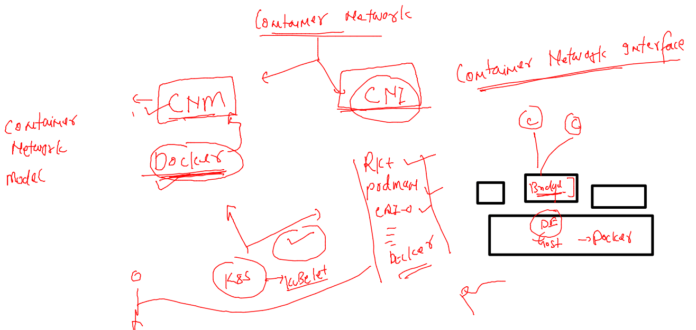

### CNI plugins to implement in k8s 

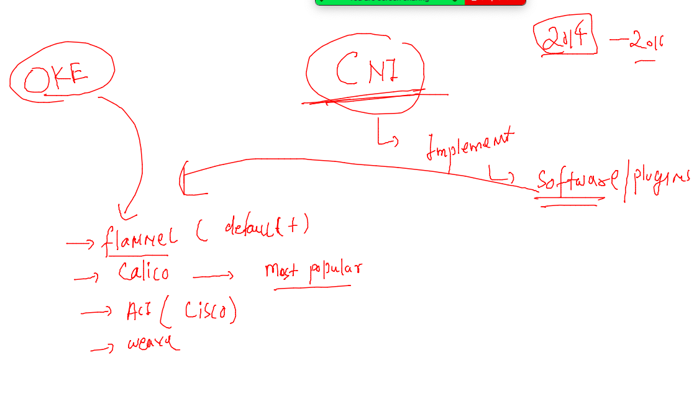

### case 1 tunnel based access from kubernetes client machine 

```
 kubectl port-forward  ashuwebapp  1234:80 
Forwarding from 127.0.0.1:1234 -> 80
Forwarding from [::1]:1234 -> 80
Handling connection for 1234

```

