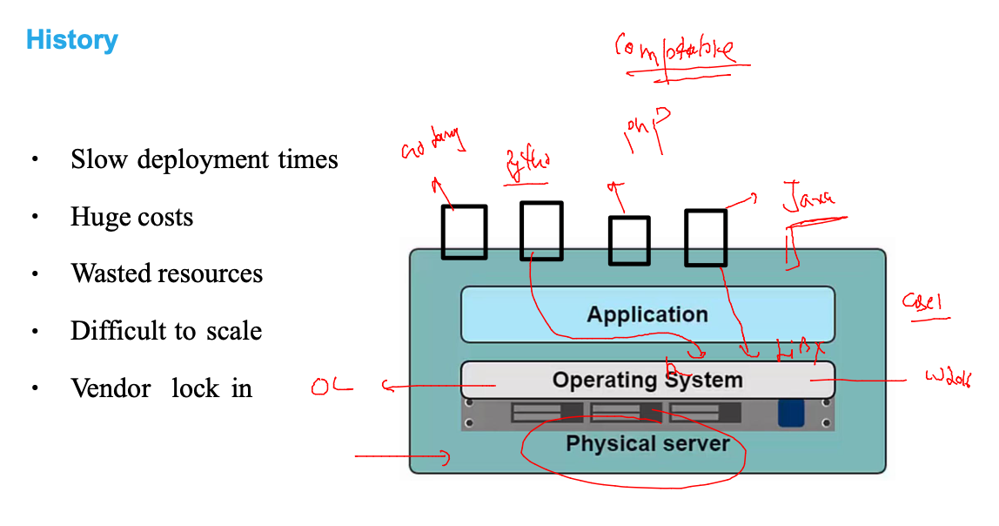
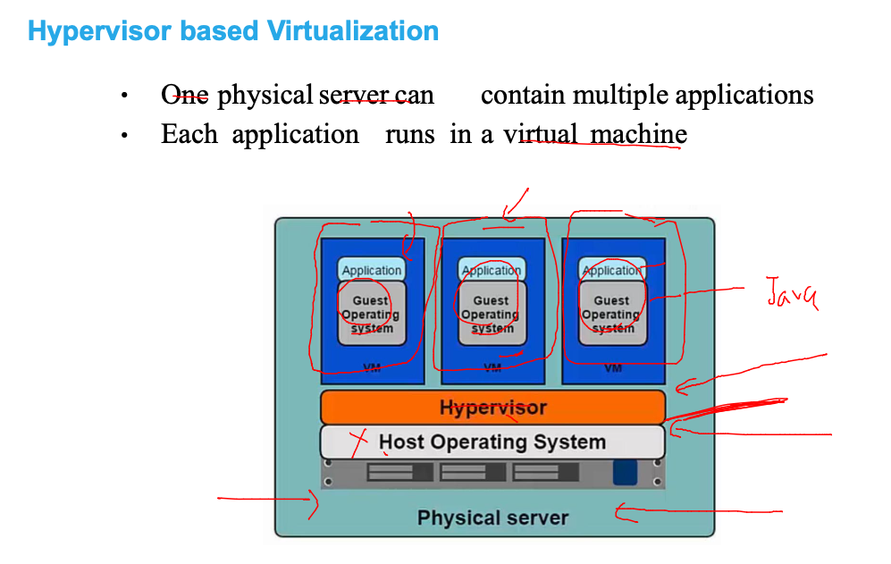
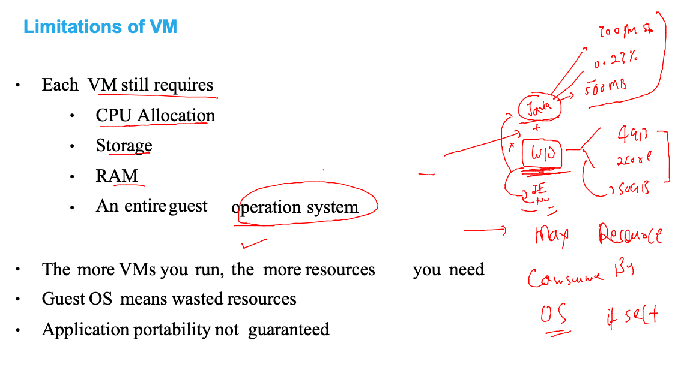
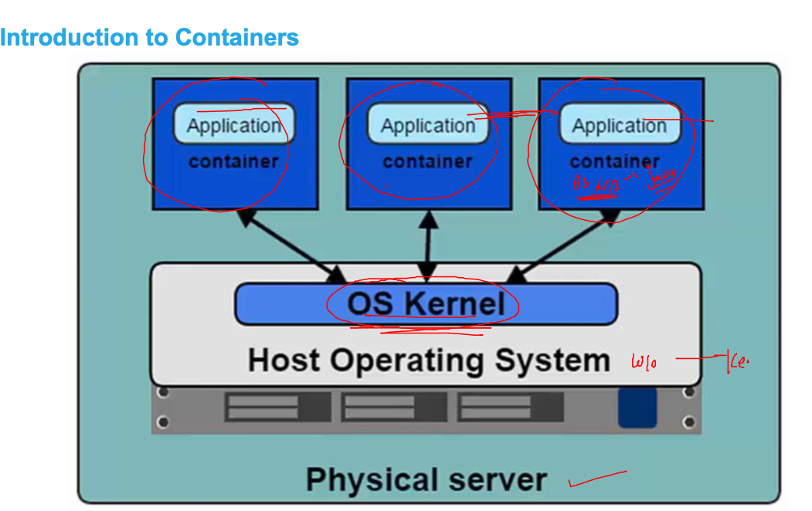
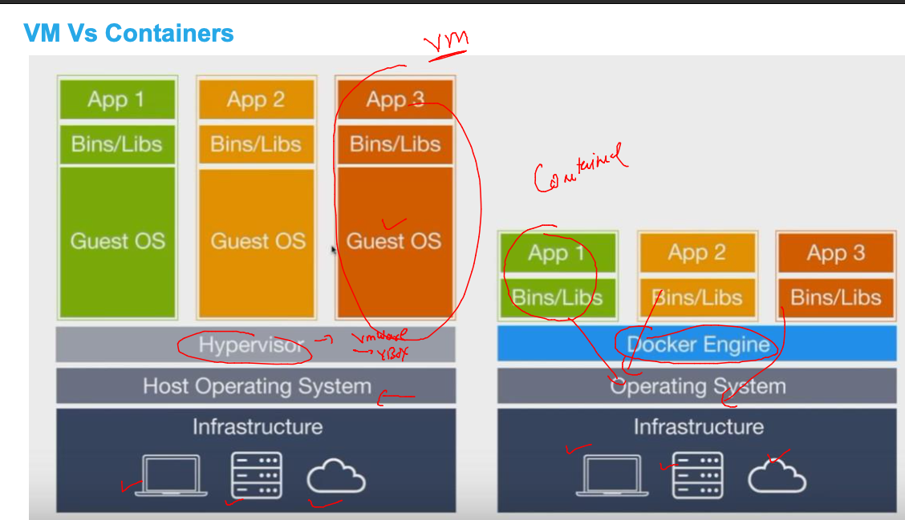
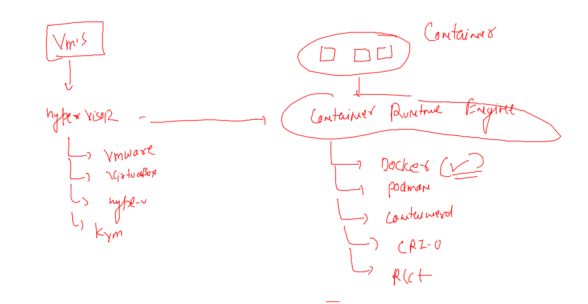
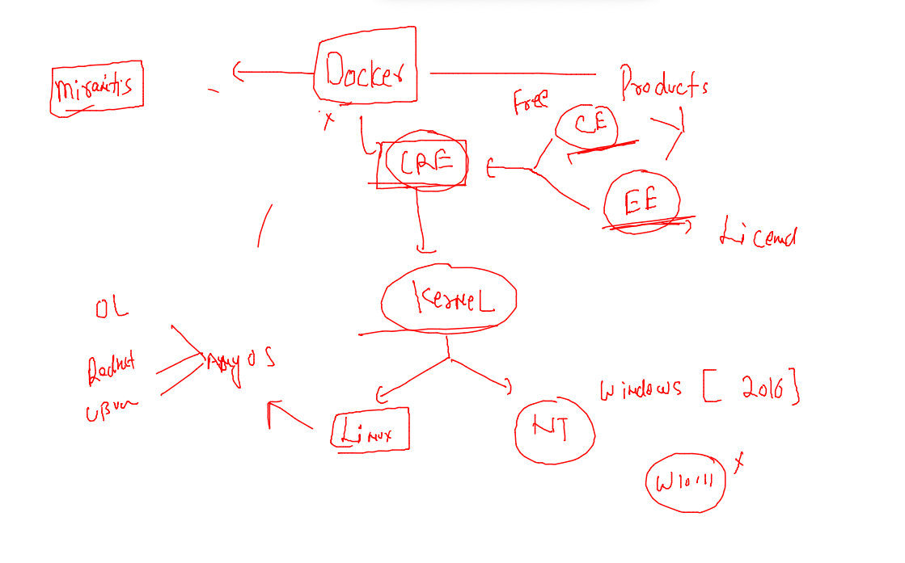

# Plan 


## problem in bare-metal with multiple apps 



### VM as solution 



### problem in vms



## Introduction to containers



### vm vs container 



## DOcker containers 



### Docker support 



### Docker Installation on OCI vm 

```
 
[root@docker-vm ~]# yum  install  docker 
Ksplice for Oracle Linux 8 (x86_64)                                                    3.8 MB/s | 708 kB     00:00    
MySQL 8.0 for Oracle Linux 8 (x86_64)                                                   24 MB/s | 2.2 MB     00:00    
MySQL 8.0 Tools Community for Oracle Linux 8 (x86_64)                                  3.3 MB/s | 249 kB     00:00    
MySQL 8.0 Connectors Community for Oracle Linux 8 (x86_64)                             238 kB/s |  20 kB     00:00    

Oracle Software for OCI users on 

=== systemctl enable --now docker 
```

### checking docker version 

```
 docker version 
Client: Docker Engine - Community
 Version:           19.03.11-ol
 API version:       1.40
 Go version:        go1.16.2
 Git commit:        9bb540d
 Built:             Fri Jul 23 01:33:55 2021
 OS/Arch:           linux/amd64
 Experimental:      false

Server: Docker Engine - Community
 Engine:
  Version:          19.03.11-ol
  API version:      1.40 (minimum version 1.12)
  Go version:       go1.16.2
  Git commit:       9bb540d
  Built:            Fri Jul 23 01:32:08 2021
```

