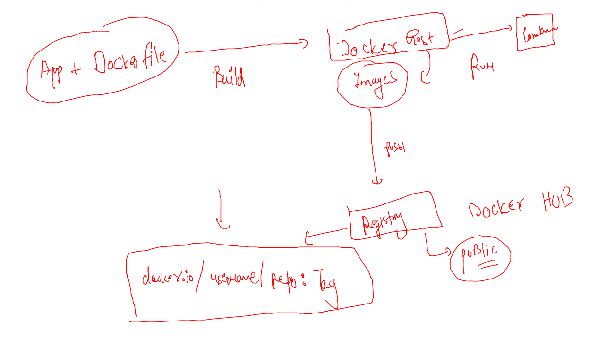
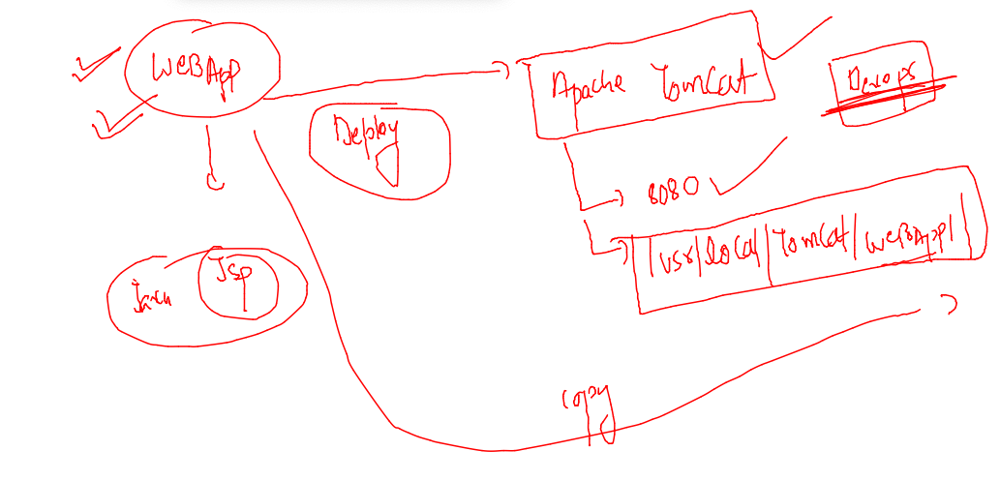

# Plan 


## Docker summary 



## javaweb containerization -- 



### 

```
]$ ls
Dockerfile  myapp  README.md
[ashu@docker-new-vm javawebapp]$ docker build  -t ashujava:webappv1  .   
Sending build context to Docker daemon  239.1kB
Step 1/6 : FROM tomcat
Trying to pull repository docker.io/library/tomcat ... 
latest: Pulling from docker.io/library/tomcat
5492f66d2700: Already exists 
540ff8c0841d: Already exists 
a0bf850a0df0: Already exists 
d751dc38ae51: Already exists 

```

### pushing image to docker hub

```
[ashu@docker-new-vm ~]$ docker  tag   ashujava:webappv1    docker.io/dockerashu/ashujava:webappv1 
[ashu@docker-new-vm ~]$ 
[ashu@docker-new-vm ~]$ docker login 
Login with your Docker ID to push and pull images from Docker Hub. If you don't have a Docker ID, head over to https://hub.docker.com to create one.
Username: dockerashu
Password: 
WARNING! Your password will be stored unencrypted in /home/ashu/.docker/config.json.
Configure a credential helper to remove this warning. See
https://docs.docker.com/engine/reference/commandline/login/#credentials-store

Login Succeeded
[ashu@docker-new-vm ~]$ docker  push  docker.io/dockerashu/ashujava:webappv1
The push refers to repository [docker.io/dockerashu/ashujava]
102eb6b843f7: Pushed 
6149e55e9822: Pushed 
522a579e7b4e: Mounted from shubhaman/shubham_javawebapp 
c59188b6de03: Mounted from shubhaman/shubham_javawebapp 
```

### creating container 

```
 docker  run  -d  --name ashujc1   -p 1234:8080   ashujava:webappv1
```
