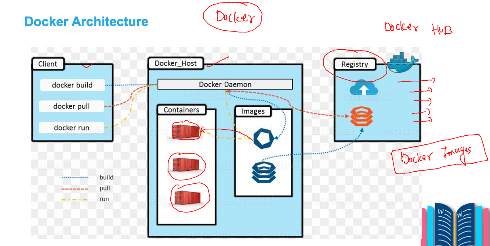
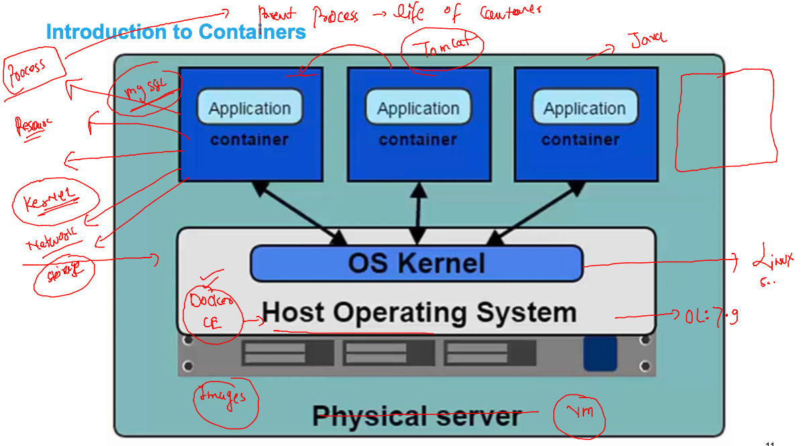
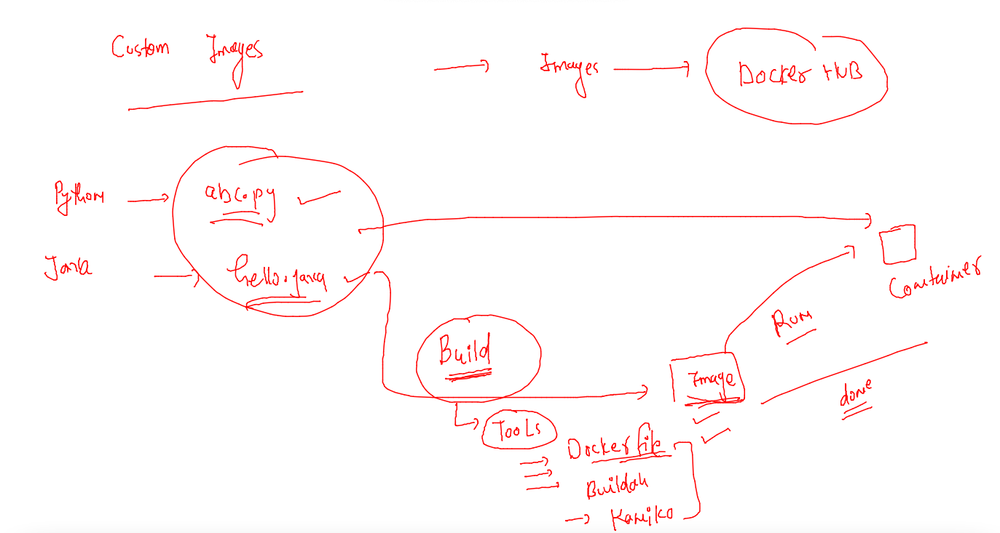

# Plan 


## problem in bare-metal with multiple apps 


### VM as solution 


### problem in vms


## Introduction to containers


### vm vs container 


## DOcker containers 


### Docker support 


### Docker Installation on OCI vm 

```
 
[root@docker-vm ~]# yum  install  docker 
Ksplice for Oracle Linux 8 (x86_64)                                                    3.8 MB/s | 708 kB     00:00    
MySQL 8.0 for Oracle Linux 8 (x86_64)                                                   24 MB/s | 2.2 MB     00:00    
MySQL 8.0 Tools Community for Oracle Linux 8 (x86_64)                                  3.3 MB/s | 249 kB     00:00    
MySQL 8.0 Connectors Community for Oracle Linux 8 (x86_64)                             238 kB/s |  20 kB     00:00    

Oracle Software for OCI users on 

=== systemctl enable --now docker 
```

### checking docker version 

```
 docker version 
Client: Docker Engine - Community
 Version:           19.03.11-ol
 API version:       1.40
 Go version:        go1.16.2
 Git commit:        9bb540d
 Built:             Fri Jul 23 01:33:55 2021
 OS/Arch:           linux/amd64
 Experimental:      false

Server: Docker Engine - Community
 Engine:
  Version:          19.03.11-ol
  API version:      1.40 (minimum version 1.12)
  Go version:       go1.16.2
  Git commit:       9bb540d
  Built:            Fri Jul 23 01:32:08 2021
```

### containers and its images 



## Docker client side Operations --

### docker image pulling 

### 

```
[ashu@docker-new-vm ~]$ docker  images
REPOSITORY          TAG                 IMAGE ID            CREATED             SIZE
[ashu@docker-new-vm ~]$ docker  pull   mysql  
Using default tag: latest
Trying to pull repository docker.io/library/mysql ... 
latest: Pulling from docker.io/library/mysql
a4b007099961: Already exists 
e2b610d88fd9: Already exists 
38567843b438: Already exists 
5fc423bf9558: Already exists 
aa8241dfe828: Already exists 
cc662311610e: Already exists 
9832d1192cf2: Already exists 
f2aa1710465f: Already exists 
4a2d5722b8f3: Pull complete 
3a246e8d7cac: Pull complete 
2f834692d7cc: Pull complete 
a37409568022: Pull complete 
Digest: sha256:b2ae0f527005d99bacdf3a220958ed171e1eb0676377174f0323e0a10912408a
Status: Image is up to date for mysql:latest
mysql:latest
[ashu@docker-new-vm ~]$ docker  images
REPOSITORY          TAG                 IMAGE ID            CREATED             SIZE
mysql               latest              562c9bc24a08        9 days ago          521MB
```

### pulling 

```
[ashu@docker-new-vm ~]$ docker  pull  oraclelinux:8.5 
Trying to pull repository docker.io/library/oraclelinux ... 
8.5: Pulling from docker.io/library/oraclelinux
00e01bb8b231: Pull complete 
Digest: sha256:0c4f3ad8df0afe5be952b9d67b7c89c772aba29bec333ec855bc8684f502fd4e
Status: Downloaded newer image for oraclelinux:8.5
oraclelinux:8.5
[ashu@docker-new-vm ~]$ docker  images
REPOSITORY          TAG                 IMAGE ID            CREATED             SIZE
oraclelinux         8.5                 c23ed56a9693        3 days ago          235MB
alpine              latest              9c842ac49a39        4 days ago          5.57MB
mysql               latest              562c9bc24a08        9 days ago          521MB
```

### docker image remove 

```
ashu@docker-new-vm ~]$ docker rmi   9fbf7d1c04fe 
Untagged: oraclelinux:7.5
Untagged: oraclelinux@sha256:aacb3ca22fa4089375be9b44b1cd9638fb3521695919f5a64cc833217e8c2c21
Deleted: sha256:9fbf7d1c04feccd465f9cc4295bb0172bc939952ec22c24f36de39fea43be6ae
Deleted: sha256:78e91243d69c91f6c481419254a2fcdf2e1ca642a534b90d3a0b28e416a1bad9
[ashu@docker-new-vm ~]$ 
[ashu@docker-new-vm ~]$ 
[ashu@docker-new-vm ~]$ docker  images
REPOSITORY          TAG                 IMAGE ID            CREATED             SIZE
oraclelinux         8.5                 c23ed56a9693        3 days ago          235MB
alpine              latest              9c842ac49a39        4 days ago          5.57MB
mysql               latest              562c9bc24a08        9 days ago          521MB
```

### COntainer process importance 



### Creating container 

```
 
[ashu@docker-new-vm ~]$ docker  run   --name  ashuc1   -d    alpine:latest    ping  google.com  
87d3fbdd7b6f9fbdb6e1ca9ee8656454c2223d98d366ba0c2a49778f24d09b01
```

### checking list of running container 

```
docker   ps
CONTAINER ID        IMAGE               COMMAND             CREATED              STATUS              PORTS               NAMES
d1663ef5c706        alpine:latest       "ping google.com"   6 seconds ago        Up 5 seconds                            ganesh1
0c054e9ebd6b        alpine:latest       "ping google.com"   7 seconds ago        Up 6 seconds                            nmallela
b8faddc3ee36        alpine:latest       "ping google.com"   13 seconds ago       Up 12 seconds                           muthu1
d8a2660d4f07        alpine:latest       "ping google.com"   About a minute ago   Up About a minute                       db1
87d3fbdd7b6f        alpine:latest       "ping google.com"   About a minute ago   Up About a minute                       ashuc1
```

### check resource used by containers 

```
[ashu@docker-new-vm ~]$ docker  stats  ashuc1 
CONTAINER ID        NAME                CPU %               MEM USAGE / LIMIT   MEM %               NET I/O             BLOCK I/O           PIDS
87d3fbdd7b6f        ashuc1              0.01%               288KiB / 15.35GiB   0.00%               37.5kB / 35.5kB     0B / 0B             1
^C

```

### to check all the containers 

```
[ashu@docker-new-vm ~]$ docker  ps -a
CONTAINER ID        IMAGE               COMMAND             CREATED             STATUS                      PORTS               NAMES
6e07f0e5e9b0        alpine:latest       "ping google.com"   26 seconds ago      Exited (0) 18 seconds ago                       satish1
b37af956f329        alpine:latest       "ping google.com"   3 minutes ago       Up 3 minutes                                    sparsh1
9d77f66c3d88        alpine:latest       "/bin/sh"           4 minutes ago       Exited (0) 4 minutes ago                        skC1
37cd6add8cc5        alpine:latest       "ping google.com"   6 minutes ago       Up 6 minutes         

```

### to check output of container parent process

```
docker  logs   ashuc1 
```

### stop a container 

```
docker  stop  ashuc1
```

### start container 

```
ashu@docker-new-vm ~]$ docker  start  ashuc1
ashuc1
```
### accessing container 

```
docker  exec  -it  ashuc1    sh 
/ # cat  /etc/os-release 
NAME="Alpine Linux"
ID=alpine
VERSION_ID=3.15.2
PRETTY_NAME="Alpine Linux v3.15"
HOME_URL="https://alpinelinux.org/"
BUG_REPORT_URL="https://bugs.alpinelinux.org/"
/ # ls
bin    dev    etc    home   lib    media  mnt    opt    proc   root   run    sbin   srv    sys    tmp    usr    var
/ # ps  -e
PID   USER     TIME  COMMAND
    1 root      0:00 ping google.com
    6 root      0:00 sh
   13 root      0:00 ps -e
/ # exit
[ashu@docker-new-vm ~]$ 

```

### stop and remove containers 

```
 
[ashu@docker-new-vm ~]$ docker  stop  ashuc1
ashuc1
[ashu@docker-new-vm ~]$ docker  rm  ashuc1 
ashuc1
```

## Docker image building 



### first docker image 
```
]$ ls
abc.py  Dockerfile
[ashu@docker-new-vm python_images]$ docker  build  -t  ashupython:1.0  . 
Sending build context to Docker daemon  3.072kB
Step 1/6 : FROM python
Trying to pull repository docker.io/library/python ... 
latest: Pulling from docker.io/library/python
5492f66d2700: Pull complete 
540ff8c0841d: Pull complete 
a0bf850a0df0: Pull complete 
d751dc38ae51: Pull complete 
9720a112e886: Pull complete 
f97b81fbdbd9: Pull complete 
a70c58953c25: Pull complete 
6f7b858c1584: Pull complete 
74b4b07d81e4: Pull complete 
Digest: sha256:6441e2f0bd2e566de0df6445cb8e7e395ea1a376dd702de908d70401d3700961
Status: Downloaded newer image for python:latest
 ---> ee2a4300ffa2
Step 2/6 : LABEL name=ashutoshh

 ---> Running in b17377d4f630
Removing intermediate container b17377d4f630
 ---> 80f835dd5033
Step 3/6 : LABEL email=ashutoshh@linux.com
 ---> Running in 45c50dc7b136
Removing intermediate container 45c50dc7b136
 ---> f68ea74e5e91
Step 4/6 : RUN  mkdir  /codes
 ---> Running in cc9d329dcda1
Removing intermediate container cc9d329dcda1
 ---> 464de7ec450d
Step 5/6 : COPY  abc.py  /codes/
 ---> ff8e5505cf63
Step 6/6 : CMD ["python","/codes/abc.py"]
 ---> Running in 2243b517c118
Removing intermediate container 2243b517c118
 ---> 1e8cd06395d8
Successfully built 1e8cd06395d8
Successfully tagged ashupython:1.0
```

### create container 

```
docker  run  -it -d  --name ashuc1 ashupython:1.0  
97c5f569563c57e0b651f2d057895c601742bef9006739d22c8b26cfea14d00b
[ashu@docker-new-vm python_images]$ docker  ps
CONTAINER ID        IMAGE               COMMAND                  CREATED             STATUS              PORTS               NAMES
97c5f569563c        ashupython:1.0      "python /codes/abc.py"   9 seconds ago       Up 8 seconds                            ashuc1
```

### Dockerfile --

```
$ ls
abc.py  code1.dockerfile  Dockerfile  helloc1.txt
[ashu@docker-new-vm python_images]$ docker  build  -t  ashupython:2.0  -f  code1.dockerfile  .  
Sending build context to Docker daemon  5.632kB
Step 1/7 : FROM oraclelinux:8.4
 ---> 97e22ab49eea
Step 2/7 : LABEL name=ashutoshh
 ---> Running in 731309d3a56a
Removing intermediate container 731309d3a56a
 ---> d0ac1ea8de2a
Step 3/7 : LABEL email=ashutoshh@linux.com
 ---> Running in 8c552a03e1da
Removing intermediate container 8c552a03e1da
 ---> 970edcc820fb
Step 4/7 : RUN  yum install python3 -y
 ---> Running in 5e5370845ba5
Oracle Linux 8 BaseOS Latest (x86_64)           178 MB/s |  43 MB     00:00    
Oracle Linux 8 Application Stream (x86_64)      191 MB/s |  32 MB     00:00    
Last metadata expiration check: 0:00:06 ago on Mon Mar 28 10:16:09 2022.
Dependencies resolved.
```

## Java code to docker image 

### scode 

```
class myclass { 
    public static void main(String args[]) 
    { 
        // test expression 
        while (true) { 
            System.out.println("Hello World"); 
  
            // update expression 
        } 
    } 
} 
```

### dockerfile 

```
FROM openjdk 
LABEL name=ashutoshh
RUN mkdir /javacode 
COPY  hello.java  /javacode/
WORKDIR /javacode
#  to change directory during image build time 
RUN javac  hello.java 
#  compiled source code 
CMD ["java","myclass"]
# setting default process 


```

### build image 

```
 docker  build -t ashujava:v1  . 
Sending build context to Docker daemon  3.072kB
Step 1/7 : FROM openjdk
Trying to pull repository docker.io/library/openjdk ... 
latest: Pulling from docker.io/library/openjdk
1de6f411eccf: Pull complete 
9fbc23973719: Pull complete 
60dc74147863: Pull complete 
Digest: sha256:d3ba674d6cbaf782030d708c3bd5eec291f56de2473a6136b9ab427753810482
Status: Downloaded newer image for openjdk:latest
 ---> 30a9bb3b2109
Step 2/7 : LABEL name=ashutoshh
 ---> Running in b8cecef63e4d
Removing intermediate container b8cecef63e4d
 ---> 7888c1ca463b
Step 3/7 : RUN mkdir /javacode
 ---> Running in 1c686c3bb379
Removing intermediate container 1c686c3bb379
 ---> 341ff62841fd
Step 4/7 : COPY  hello.java  /javacode/
 ---> 4347ee5e4225
Step 5/7 : WORKDIR /javacode
 ---> Running in 6b551189a9cc
Removing intermediate container 6b551189a9cc
 ---> 5a6b940f8098
Step 6/7 : RUN javac  hello.java
 ---> Running in 3fc74bf33030
Removing intermediate container 3fc74bf33030
 ---> 60777ef1f121
Step 7/7 : CMD ["java","myclass"]
 ---> Running in 4728bc68c7f7
Removing intermediate container 4728bc68c7f7
 ---> 3f1e21f1af0c
Successfully built 3f1e21f1af0c
Successfully tagged ashujava:v1
```

## image sharing with Docker HUb 


### pushing image 
```
docker  images  |   grep -i ashu
ashujava            v1                  3f1e21f1af0c        23 minutes ago      471MB
ashupython          2.0                 924a988ab1c2        About an hour ago   420MB
ashupython          1.0                 1e8cd06395d8        2 hours ago         919MB
[ashu@docker-new-vm java_images]$ 
[ashu@docker-new-vm java_images]$ 
[ashu@docker-new-vm java_images]$ docker  tag  ashujava:v1    docker.io/dockerashu/ashujavacode:1.1  

[ashu@docker-new-vm java_images]$ docker  login 
Login with your Docker ID to push and pull images from Docker Hub. If you don't have a Docker ID, head over to https://hub.docker.com to create one.
Username: dockerashu
Password: 
WARNING! Your password will be stored unencrypted in /home/ashu/.docker/config.json.
Configure a credential helper to remove this warning. See
https://docs.docker.com/engine/reference/commandline/login/#credentials-store

Login Succeeded
```


