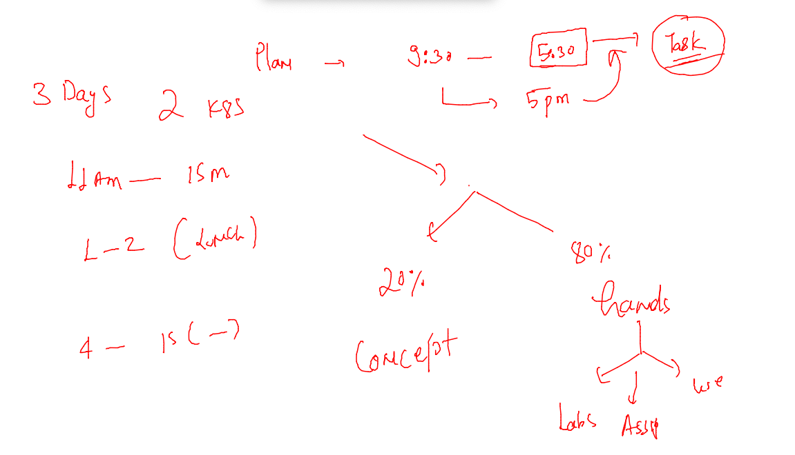

# Plan 



## Docker Networking


### docker network commands 

```
 docker network ls 
NETWORK ID          NAME                DRIVER              SCOPE
aed9392c4333        bridge              bridge              local
7c7eef41f349        host                host                local
43691b97d25c        none                null                local
[ashu@docker-new-vm myimages]$ 
[ashu@docker-new-vm myimages]$ 
[ashu@docker-new-vm myimages]$ docker network  inspect  aed9392c4333 
[
    {
        "Name": "bridge",
        "Id": "aed9392c43330f694adada0304782d67b221704b11e3ba957a4d8c445235d40f",
        "Created": "2022-03-30T05:10:22.075828391Z",
        "Scope": "local",
        "Driver": "bridge",
        "EnableIPv6": false,
        "IPAM": {
            "Driver": "default",
            "Options": null,
            "Config": [
                {
                    "Subnet": "172.17.0.0/16",
                    "Gateway": "172.17.0.1"
                }
            ]
        },
        "Internal": false,
        "Attachable": false,
        "Ingress": false,
        "ConfigFrom": {
            "Network": ""
        },
        "ConfigOnly": false,
        "Containers": {},
        "Options": {
            "com.docker.network.bridge.default_bridge": "true",
            "com.docker.network.bridge.enable_icc": "true",
            "com.docker.network.bridge.enable_ip_masquerade": "true",
            "com.docker.network.bridge.host_binding_ipv4": "0.0.0.0",
            "com.docker.network.bridge.name": "docker0",
            "com.docker.network.driver.mtu": "1500"

```

### creating bridge 

```
 273  docker network  create  ashubr1 
  274  docker network  inspect  ashubr1
  275  history 
[ashu@docker-new-vm myimages]$ docker network ls 
NETWORK ID          NAME                DRIVER              SCOPE
3aeffea456d5        ashubr1             bridge              local
aed9392c4333        bridge              bridge              local
f6c183369703        ganeshbr1           bridge              local
7c7eef41f349        host                host                local
```

### containers from same bridge can connect to each other 

```
 docker  exec -it  ashuc1  sh 
/ # 
/ # ifconfig 
eth0      Link encap:Ethernet  HWaddr 02:42:AC:11:00:02  
          inet addr:172.17.0.2  Bcast:172.17.255.255  Mask:255.255.0.0
          UP BROADCAST RUNNING MULTICAST  MTU:1500  Metric:1
          RX packets:13 errors:0 dropped:0 overruns:0 frame:0
          TX packets:0 errors:0 dropped:0 overruns:0 carrier:0
          collisions:0 txqueuelen:0 
          RX bytes:1086 (1.0 KiB)  TX bytes:0 (0.0 B)

lo        Link encap:Local Loopback  
          inet addr:127.0.0.1  Mask:255.0.0.0
          UP LOOPBACK RUNNING  MTU:65536  Metric:1
          RX packets:0 errors:0 dropped:0 overruns:0 frame:0
          TX packets:0 errors:0 dropped:0 overruns:0 carrier:0
          collisions:0 txqueuelen:1000 
          RX bytes:0 (0.0 B)  TX bytes:0 (0.0 B)

/ # ping  172.17.0.4
PING 172.17.0.4 (172.17.0.4): 56 data bytes
64 bytes from 172.17.0.4: seq=0 ttl=64 time=0.126 ms
64 bytes from 172.17.0.4: seq=1 ttl=64 time=0.064 ms
64 bytes from 172.17.0.4: seq=2 ttl=64 time=0.062 ms
64 bytes from 172.17.0.4: seq=3 ttl=64 time=0.074 ms
64 bytes from 172.17.0.4: seq=4 ttl=64 time=0.068 ms
64 bytes from 172.17.0.4: seq=5 ttl=64 time=0.066 ms
^C
--- 172.17.0.4 ping statistics ---
6 packets transmitted, 6 packets received, 0% packet loss
round-trip min/avg/max = 0.062/0.076/0.126 ms
/ # 
```
### by default container from different bridge can't communicate 

```
 docker  run -itd --name  ashuc2 --network ashubr1  alpine
d99ee27f31e6e568ff6b20bfbd5cdcb80dfffeb7fde4663e61ea4a4bfc43e7cc
[ashu@docker-new-vm myimages]$ docker exec -it  ashuc2  sh 
/ # ping  172.17.0.2
PING 172.17.0.2 (172.17.0.2): 56 data bytes
^C
--- 172.17.0.2 ping statistics ---
9 packets transmitted, 0 packets received, 100% packet loss
/ # exit
```
### create bridge delete 

```
 docker network  create  ashubr2 --subnet 192.168.1.0/24 
fe5bd6ce6986e5da0bb84416ef6bd1cf22f8c5af0f0865ed7bc3a6ee2f259d7a
[ashu@docker-new-vm myimages]$ 
[ashu@docker-new-vm myimages]$ 
[ashu@docker-new-vm myimages]$ docker  network rm ashubr2
ashubr2
```


