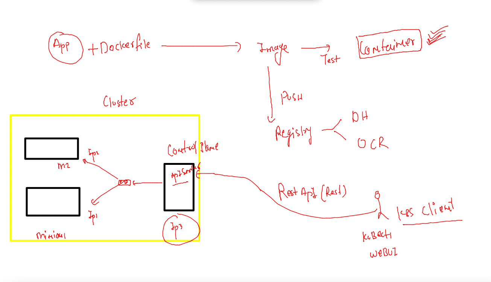
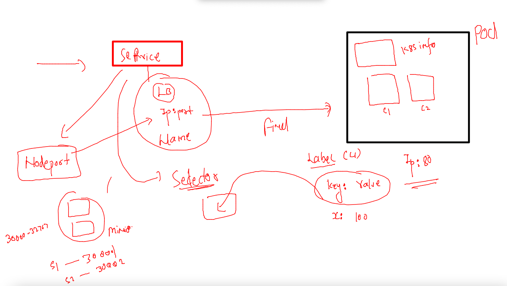

# Plan 


## k8s revision 1 



### etcd -- brain of k8s 


### service understanding again 



### deleting 

```
kubectl delete pod,svc --all
pod "amitwebapp" deleted
pod "ashuwebapp" deleted
pod "chethanwebapp" deleted
pod "ganeshwebapp" deleted
pod "muthuwebapp" deleted
pod "sameerwebapp" deleted
pod "shubhamwebapp" deleted
pod "skpod1" deleted
pod "skwebapp" deleted
service "ashulb1" deleted
service "chethanlb1" deleted
service "ganeshlb1" deleted
```

### creating pod 

```
 565  kubectl  run  ashuwebpod  --image=dockerashu/customerapp:30thmarch2022     --port 80 
  566  history r
  567  history 
[ashu@docker-new-vm myimages]$ kubectl get  po
NAME            READY   STATUS    RESTARTS   AGE
ashuwebpod      1/1     Running   0          27s
shubhamwebpod   1/1     Running   0          8s
[ashu@docker-new-vm myimages]$ kubectl get  po
NAME            READY   STATUS    RESTARTS   AGE
ashuwebpod      1/1     Running   0          40s
shubhamwebpod   1/1     Running   0          21s
[ashu@docker-new-vm myimages]$ kubectl get  po
NAME            READY   STATUS    RESTARTS   AGE
ashuwebpod      1/1     Running   0          83s
ganeshwebpod    1/1     Running   0          25s
muthuwebpod     1/1     Running   0          40s
nareshwebpod    1/1     Running   0          21s
sameerwebpod    1/1     Running   0          14s
shubhamwebpod   1/1     Running   0          64s
skpod           1/1     Running   0          15s
[ashu@docker-new-vm myimages]$ kubectl get  po -o wide
NAME            READY   STATUS    RESTARTS   AGE   IP                NODE                            NOMINATED NODE   READINESS GATES
ashuwebpod      1/1     Running   0          98s   192.168.203.219   ip-172-31-85-52.ec2.internal    <none>           <none>
ganeshwebpod    1/1     Running   0          40s   192.168.203.254   ip-172-31-85-52.ec2.internal    <none>           <none>
muthuwebpod     1/1     Running   0          55s   192.168.93.9      ip-172-31-29-225.ec2.internal   <none>           <none>
nareshwebpod    1/1     Running   0          36s   192.168.203.216   ip-172-31-85-52.ec2.internal    <none>           <none>
sameerwebpod    1/1     Running   0          29s   192.168.93.40     ip-172-31-29-225.ec2.internal   <none>           <none>
shubhamwebpod   1/1     Running   0          79s   192.168.93.21     ip-172-31-29-225.ec2.internal   <none>           <none>
skpod           1/1     Running   0          30s   192.168.203.252   ip-172-31-85-52.ec2.internal    <none>           <none>
[ashu@docker-new-vm myimages]$ 
```

### before you create service check pod labels 

```
kubectl get  po --show-labels
NAME             READY   STATUS             RESTARTS      AGE     LABELS
amittest1        0/1     CrashLoopBackOff   3 (32s ago)   7m56s   run=amittest1
amittest2        1/1     Running            3 (34s ago)   5m48s   run=amittest2
amitwebpod       1/1     Running            0             10m     run=amitwebpod
ashutest1        1/1     Running            3 (87s ago)   6m42s   run=ashutest1
ashuwebpod       1/1     Running            0             13m     run=ashuwebpod
chethanwebpod    1/1     Running            0             10m     run=chethanwebpod

```

### service of nodeport type 

### yaml generate 

```
[ashu@docker-new-vm myimages]$ kubectl  create  service  
Create a service using a specified subcommand.

Aliases:
service, svc

Available Commands:
  clusterip    Create a ClusterIP service
  externalname Create an ExternalName service
  loadbalancer Create a LoadBalancer service
  nodeport     Create a NodePort service

Usage:
  kubectl create service [flags] [options]

Use "kubectl <command> --help" for more information about a given command.
Use "kubectl options" for a list of global command-line options (applies to all commands).
[ashu@docker-new-vm myimages]$ kubectl  create  service  nodeport  ashusvc1  --tcp  1234:80   --dry-run=client -oyaml 
apiVersion: v1
kind: Service
metadata:
  creationTimestamp: null
  labels:
```

### matching service selector 


### service check 

```

[ashu@docker-new-vm k8s_apps]$  kubectl get  po  ashuwebpod  --show-labels
NAME         READY   STATUS    RESTARTS   AGE   LABELS
ashuwebpod   1/1     Running   0          17m   run=ashuwebpod
[ashu@docker-new-vm k8s_apps]$ kubectl apply -f ashusvc.yaml 
service/ashusvc1 created
[ashu@docker-new-vm k8s_apps]$ kubectl   get  svc
NAME         TYPE        CLUSTER-IP       EXTERNAL-IP   PORT(S)          AGE
ashusvc1     NodePort    10.103.94.2      <none>        1234:31712/TCP   4s
ganeshvc1    NodePort    10.106.219.118   <none>        1234:30841/TCP   4s
```

### matching pod label with service selector 

```
  kubectl get  po  ashuwebpod  --show-labels
NAME         READY   STATUS    RESTARTS   AGE   LABELS
ashuwebpod   1/1     Running   0          28m   run=ashuwebpod
[ashu@docker-new-vm k8s_apps]$ 
[ashu@docker-new-vm k8s_apps]$ 
[ashu@docker-new-vm k8s_apps]$ kubectl  get  svc  ashusvc1  -o wide
NAME       TYPE       CLUSTER-IP    EXTERNAL-IP   PORT(S)          AGE     SELECTOR
ashusvc1   NodePort   10.103.94.2   <none>        1234:31712/TCP   8m27s   run=ashuwebpod
[ashu@docker-new-vm k8s_apps]$ 

```

### generate yaml from running pod 

```

 kubectl   get  po  ashuwebpod  -o yaml   >frompod.yaml 
 
```

### making required changes and replace it 

```
kubectl replace -f  frompod.yaml  --force
pod "ashuwebpod" deleted
pod/ashuwebpod replaced
```

### Intro to CONfigMAP 


### creating confimap 

```
 kubectl   create configmap  varstore  --from-literal  deploy=webapp3 
configmap/varstore created
[ashu@docker-new-vm k8s_apps]$ kubectl  get  configmap 
NAME               DATA   AGE
kube-root-ca.crt   1      29d
varstore           1      10s

```

### calling configmap in pod yaml 


### namespaces in k8s

```
 kubectl  get  po 
No resources found in default namespace.
[ashu@docker-new-vm k8s_apps]$ 
[ashu@docker-new-vm k8s_apps]$ 
[ashu@docker-new-vm k8s_apps]$ kubectl  get  namespaces 
NAME              STATUS   AGE
ajeet-ns          Active   3d16h
ashu-project      Active   3d16h
default           Active   29d
kube-node-lease   Active   3d16h
kube-public       Active   29d
kube-system       Active   29d
manoj-ns          Active   3d16h
surbhi-ns         Active   3d16h
[ashu@docker-new-vm k8s_apps]$ kubectl  create  namespace  ashu-space 
namespace/ashu-space created
[ashu@docker-new-vm k8s_apps]$ kubectl  get  namespaces 
NAME              STATUS   AGE
ajeet-ns          Active   3d16h
ashu-project      Active   3d16h
ashu-space        Active   4s

```


